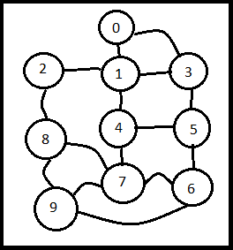

## CORRECIONES
Se realizó la INTEGRAL B la cual no había sido entregada.

# Integral-B
### INTEGRAL B AVANCE 1
En este proyecto se implementa la creación de un grafo para un hotel que se encuentra en playa del carmen. Este hotel tiene una gran extension por lo que es fácil pederse y tomar caminos demasiado largos por lo que la implementación de algoritmos de búsqueda es funcional para este caso. 

### AQUI SE PUEDE APRECIAR EL GRAFO DEL HOTEL

### SICT0302B: Toma decisiones

**Usa grafos para hacer analisis de información** 

En el archivo hotel.txt se encuentran las conexiones entre los diferentes lugares del hotel Sandos en Cancun. Estos valores serán guardados en una lista y matriz de adyacencia. 
De tal forma que se puedan proyectar en consola,tanto en forma de lista como en forma de matriz. En adición, con el archivo cargado para la creación del grafo se podrá realizar un algortimo de búsqueda ya que es muy fácil perderse en ese hotel.

**Usa un algoritmo de búsqueda en grafos adecuado para resolver un problema**

En este proyecto se utilizará un BFS ya que el objetivo es mostrar el camino más corto para llegar a diferentes partes del hotel ya que es demasiado grande y tiene muchos caminos.Esto facilitará la movilidad y hará una estancia más práctica. 

### SICT0303B: Implementa acciones científicas

**Implementa mecanismos de lectura de archivos correctos y útiles dentro de un programa.** 

Se leen los datos del archivo "hotelito.txt" con  la funcion loadGraphMat() y loadGraphList. Con esto se libera peso y trabajo al código fuente.

**Implementa mecanismos de escritura de archivos correctos.**
Se presenta esctritura de archivos en las líneas 55-67 del main.cpp donde se guarda la ruta, la matriz de adyasencia y la lista de adyasencia.

### ANÁLISIS DE COMPLEJIDAD

loadgraphlist: Esta función se basa en una lectura de un archivo por lo que su complejidad es O(n), estos datos se introducen a una lista con complejidad O(1) así que la complejidad de la funcion es O(n)

BFS: Esta función arroja el camino más corto para llegar de un nodo a otro. Su complejidad temporal es de O(V+A) para el peor de los casos, ya que le toma V+A pasos para guardar en un string la lista de nodos visitados y el camino del recorrido de un grafo, donde V es el número de vértices y A es el número de arcos del grafo.

